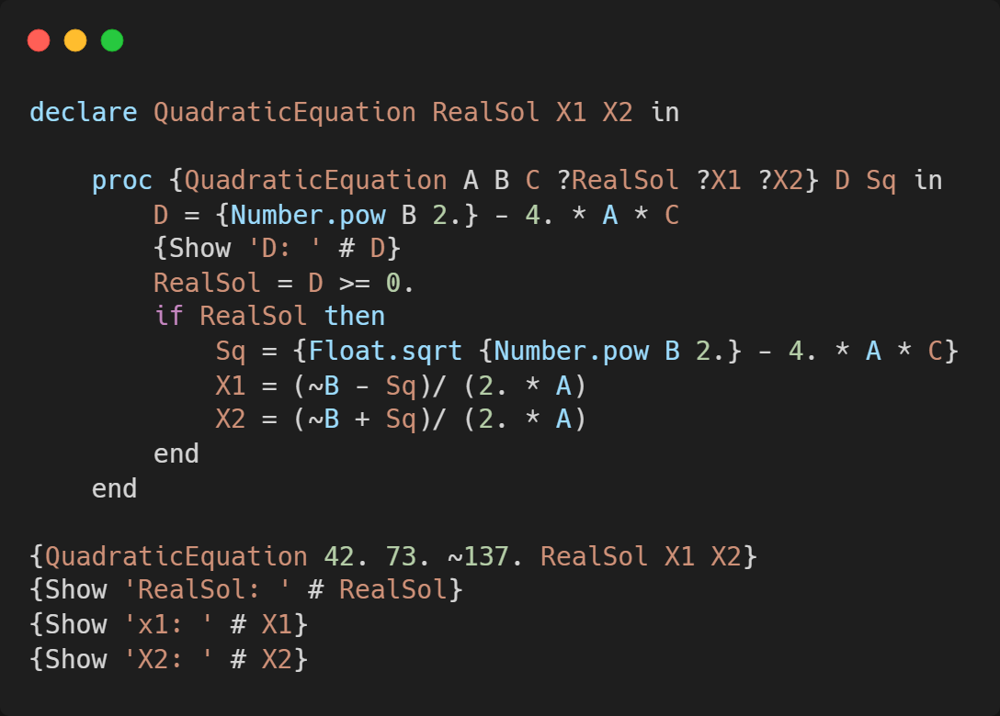
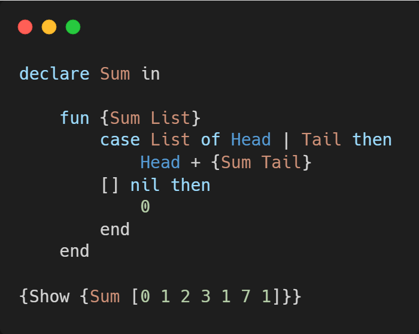
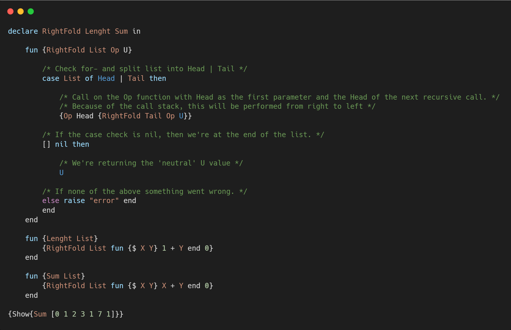
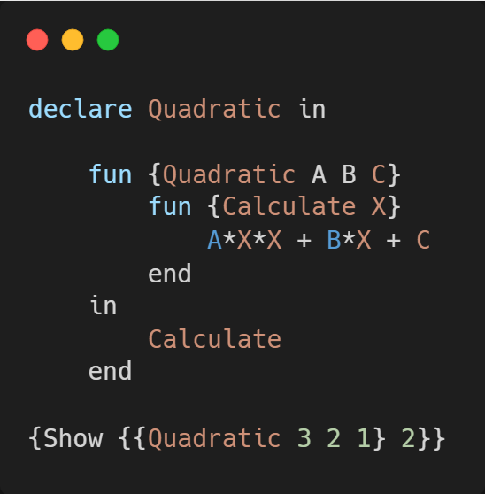
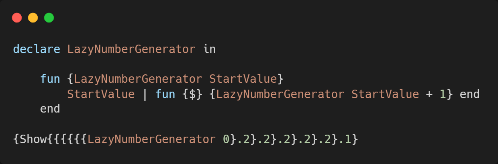
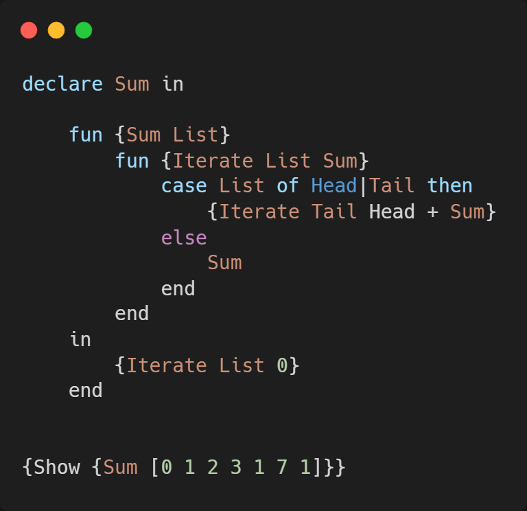

# Assignment 3

By: Alexander Høyby\
October 6, 2021

 

## Task 1

Q: Why are procedural abstractions useful? Give at least two reasons.\
A: Makes code easier to read and understand.
Provides the ability to return none, one, or multiple values.

Q: What is the difference between a procedure and a function?\
A: A function performs a task and always have one or more return values, whereas a procedure is only performing a task with no explicit return value.
  

## Task 2

  

## Task 3

Q: For the Sum and Lenght operations, would left fold (a left-associative fold) and right fold give different results? What about subtractions?\
A: Associative law states that the order of grouping the numbers does not matter. This law holds for addition and multiplication but it doesn’t hold for subtraction and division.
Sum and Lenght does therefore not care if we left or right fold. But subtraction will.

Q: What is a good value for U when using RightFold to implement the product of list elements?\
A: 1 would be a good value as it would not alter the result from list and also not make the whole result 0.
  

## Task 4

  

## Task 5

Instead of calling our main function recursively, creating an infinte call where StartValue increases towards infinity. We're
calling a function in our recursive call instead. This will suspend our current function to get an answer from our called (anonymous) function
Which will provide us with just the number of answer we want on demand and returns that value. Ending the infinte call.

A limitation here is that this method only simulates an infinite list. We're not actually returning a complete list, but a list that requres a function call.
Hence, we cannot do actions such as {LazyNumberGenerator 0}.2.2.1. as we would with a regular list.
  

## Task 6

Q: Is your Sum function from Task 2 tail recursive? If yes, explain why. If not, implement a tail recursive version and explain how your changes made it so.\
A: The tail recursive version moves from the back of the tail to the front of the list cumulating the sum along the way.

Q: What is the benefit of tail recursion in Oz?\
A: There is no need to retain a stack frame, resulting in less burden on the system, especially for deep stacks.

Q: Do all programming languages that allow recursion benefit from tail recursion? Why/why not?\
A: A tail recursive function call allows the compiler to perform a special optimization which it normally can not with regular recursion.
This would therefore be spesific to the compiler, and wheter or not the compiler has this optimization implmeneted.
